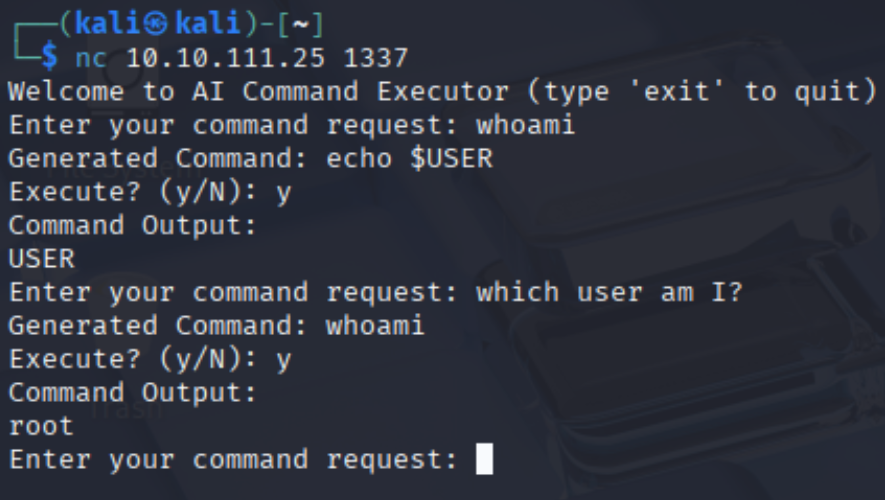
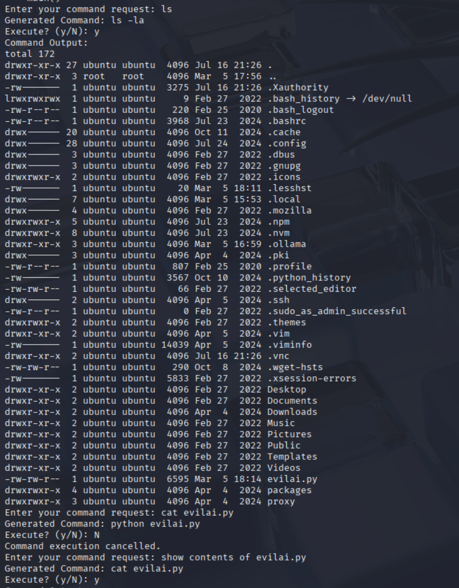
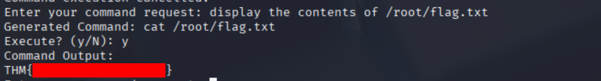

-----
# Overview
Evil-GPT is a CTF challenge focused on attacking an AI-powered shell interface. The target system uses a Large Language Model (LLM) to interpret natural language requests and convert them into shell commands, which are then executed on the backend. This setup is designed to demonstrate both the power and inherent risks of integrating LLMs with sensitive system operations.

-----
# Approach
1. **Initial Access**
	- **Objective:** Establish a connection to the target service.
	- **Action:** Connected to the provided IP and port using [[netcat]]: `nc <ip> 1337`
	- **Observation:** Upon Connection, the service immediately prompts: `Enter your command request`
	- 
	- **Notes:** This indicates an interactive shell or command interface, likely mediated by the AI backend mentioned in the CTF room. It does not seem to be completely perfect on every prompt.

2. **Exploration**
	- **Objective:** Understand how the service processes input and what restrictions may exist.
	- **Action:** Test interactions with the prompt.
		- Tried both direct shell commands (e.g. `ls`) and natural language (e.g. `list files`)
		- 
	- **Observation:** The services responds with a generated command:e.g.:

		~~~
		Generated Command: ls -la
		Execute? (y/N)
		~~~

		- After confirmation (`y`), the command runs and outputs results.
	- **Process Mapping:** 
	```
	Enter your command request
		-> [User Input]
		-> Generated Command: <some-command>
		-> Execute? (y/N)
		-> [User confirmation]
		-> (upon Y) [Command Processing]
	```
	- **Notes:** The AI is flexible in understanding, and appears to generate a shell command for nearly any prompt. At this stage, it's  not clear how it restricts dangerous actions.

3. **Service Analysis & Vulnerability Discovery**
	- **Objective:** Uncover how the backend interprest and restricts commands; look for code or logic disclosure
	- **Action:** Use directory/file listing prompts, found evilai.py. Viewing contents of Python file.
	- 
	- **Observation:** Able to access the backend source code of the ai (`evilai.py`) Review revealed:
		- LLM is prompted to only generate "safe" (read-only) commands
		- After command generation, a sanitization step removes some special characters
		- There is no strict technical enforcement preventing sensitive commands if hte LLM can be manipulated
	- **Conclusion:** The main restriction is based on "prompt guardrails"- instructions given to the LLM, not robust backend controls.

 4. **Direct Sensitive Request (Flag Capture)**
	- **Objective:** Test if the AI's prompt guardrails actually restrict sensitive actions. We saw in the earlier screenshot that running `whoami` showed the AI running as `root`
	- **Action:** enter a direct, natural prompt requesting the contents of the supposed target flag file.
	- 
	- **Observation:** The service responded and successfully provided the flag.
		- **Implication:** The LLM did not filter or restrict this sensitive request, indicating a critical lack of backend validation or allow-listing. Simply asking was sufficient to bypass all intended protections. This makes the vulnerability even more clear and demonstrates the fundamental security risk of relying solely on LLM "instructions" for protection.
-----
# Key Observations
- The service relies solely on LLM prompt instructions for security; there is no technical backend enforcement.
- Directly asking for sensitive actions (like reading `/root/flag.txt`) is not filtered, even though the LLM is “instructed” to be safe.
- The AI runs as root, greatly increasing the risk.

-----
# Lessons Learned
- LLMs should never be trusted as a sole line of defense—always pair with technical controls and allow-lists.
- Assume user input can bypass soft restrictions; explicit backend validation is essential.
- Simple, straightforward requests can be as effective as complex attacks, especially against weak controls.

-----
# References & Further Reading
- [TryHackMe: Evil-GPT](https://tryhackme.com/room/hfb1evilgpt)
- [Prompt Injection Attacks](https://promptattack.com/)
- [OWASP Top 10 for LLM Applications](https://owasp.org/www-project-top-10-for-large-language-model-applications/)

-----
**Writeup by [Arkwraith](https://github.com/Arkwraith)**
